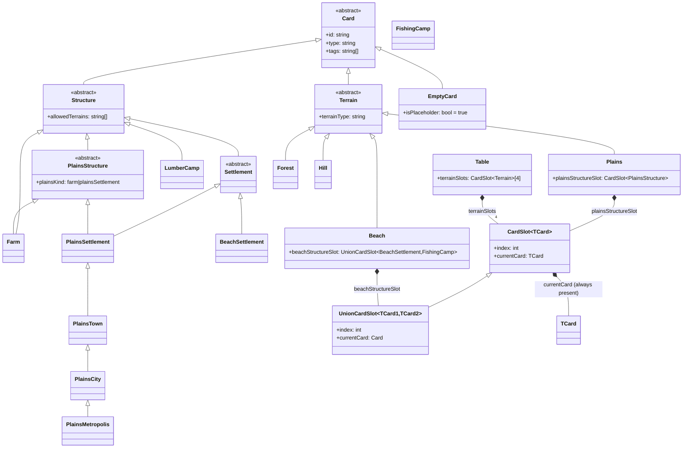
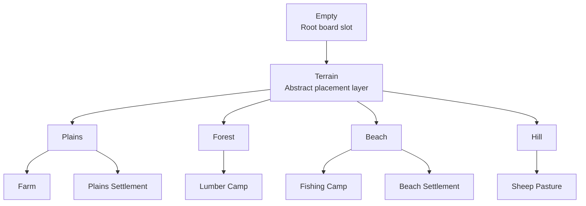
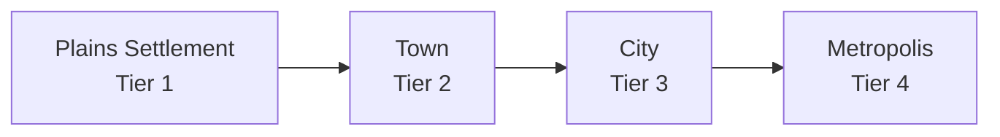

# Strategy Game — Data Structure (Placement Tech Tree)

This document is a cleaned, placement-first model for the current game direction.

Core intent:

- Land control is represented by the board and the land cards you have successfully placed.
- The deck represents exploration of unknown territories.
- Placement progression starts from Empty, then moves to terrain, then to terrain-specific implementations.

---

## UML Class Diagram (Step 4: Structure Base Class)

This UML step models the no-null invariant, concrete terrain subclasses, a structure base class, and a table that contains four terrain slots.

Step-4 intent:

- `CardSlot.currentCard` is never null.
- New slots are initialized with `EmptyCard`.
- `Terrain` is abstract and inherits from `Card`.
- `Structure` is abstract and inherits from `Card` as the base for building-like cards.
- `PlainsStructure` is an abstract `Structure` subtype used for plains-specific occupants.
- `Farm` is a concrete `Structure` subtype.
- `Settlement` is an abstract `Structure` subtype.
- `PlainsSettlement` and `BeachSettlement` are concrete subtypes under `Settlement`.
- `PlainsTown`, `PlainsCity`, and `PlainsMetropolis` are derived upgrade classes under `PlainsSettlement`.
- `LumberCamp` is a concrete `Structure` subtype.
- `CardSlot<TCard>` is generic, with `TCard` constrained to inherit from `Card`.
- `UnionCardSlot<TCard1,TCard2>` is a C#-friendly union slot where both generic types inherit from `Card`.
- Concrete terrain implementations are `Plains`, `Forest`, `Beach`, and `Hill`.
- `Plains` owns a `CardSlot<PlainsStructure>`, enabling a discriminated choice between `Farm` and `PlainsSettlement`.
- `Beach` owns a `UnionCardSlot<BeachSettlement,FishingCamp>`.
- A `Table` owns exactly four terrain slots, represented as `CardSlot<Terrain>`.
- Future steps can add concrete structure subclasses with terrain-based placement constraints.

---

## Type Table (outside the diagram)

| Type | Purpose |
|---|---|
| Empty | Root state of a controllable board slot. No production by itself. Accepts terrain placement. |
| Terrain (abstract) | Conceptual parent type for concrete terrain variants. Not a direct card in hand. |
| Structure (abstract) | Conceptual parent type for building-like cards. Carries shared placement constraints. |
| PlainsStructure (abstract) | Plains-only structure base, used as the discriminated slot type for farm/settlement placement. |
| UnionCardSlot<TCard1, TCard2> | Generic C#-style union slot that accepts either of two Card subtypes in one slot. |
| Farm | Concrete Structure implementation for agriculture-focused development on plains terrain. |
| Settlement (abstract) | Shared settlement base type for terrain-specific settlement variants. |
| Plains Settlement | Settlement implementation that can only be placed on Plains. Visually and mechanically tied to plains terrain. |
| Plains Town | First upgrade tier derived from Plains Settlement. |
| Plains City | Second upgrade tier derived from Plains Town. |
| Plains Metropolis | Final upgrade tier derived from Plains City. |
| Beach Settlement | Settlement implementation that can only be placed on Beach. Visually and mechanically tied to beach terrain. |
| Lumber Camp | Concrete Structure implementation for forestry-focused development on forest terrain. |
| Fishing Camp | Concrete Structure implementation for coastal development on beach terrain. |
| Plains | Concrete Terrain implementation. Fertile baseline terrain for agriculture-focused development. |
| Forest | Concrete Terrain implementation. Wood-focused terrain for forestry and industry chains. |
| Beach | Concrete Terrain implementation. Coastal terrain for trade and shoreline building chains. |
| Hill | Concrete Terrain implementation. Elevated terrain for pasture, defense, and upland chains. |

Note: The deck is the exploration mechanism that yields terrain cards. Playing those cards converts Empty slots into controlled territory.
Note: In JSON, concrete terrain cards use type = land and then specify terrain = Plains, Forest, Beach, or Hill.

---

## Card Placement Tech Tree

Interpretation:

- Empty is the root node and initial state of board ownership potential.
- Terrain is abstract and documents the transition rule: only terrain cards can fill Empty.
- Plains, Forest, Beach, and Hill are concrete implemented terrain outcomes.
- Building layer is shown as current implementation rules: Farm on Plains, Lumber Camp on Forest, Fishing Camp on Beach, Sheep Pasture on Hill, Plains Settlement on Plains, and Beach Settlement on Beach.

---

## Suggested Plains Settlement Upgrade Path

Proposed staged evolution for plains habitation:

Suggested modeling approach:

- Keep one slot identity and upgrade the card in-place: `CardSlot<PlainsSettlement>`.
- Model upgrade tiers as derived classes: `PlainsSettlement -> PlainsTown -> PlainsCity -> PlainsMetropolis`.
- Preserve terrain lock across all tiers: `allowedTerrains = [Plains]`.

Suggested upgrade gates:

1. Plains Settlement -> Town: requires local food baseline (for example Farm adjacency).
2. Town -> City: requires sustained production and higher population threshold.
3. City -> Metropolis: requires advanced resource mix and stability check.

Suggested JSON direction (card-definition level):

- `plains-settlement`: class = `PlainsSettlement`, upgradesTo = `plains-town`
- `plains-town`: class = `PlainsTown`, upgradesTo = `plains-city`
- `plains-city`: class = `PlainsCity`, upgradesTo = `plains-metropolis`
- `plains-metropolis`: class = `PlainsMetropolis`, terminal tier (no `upgradesTo`)

---

## Minimal Placement Rules

1. A board slot begins as Empty.
2. Only a land card can replace Empty.
3. A land card resolves to one concrete terrain type: Plains, Forest, Beach, or Hill.
4. Once a terrain exists, buildings can be placed only if their terrain requirements are met.
5. Settlement placement is terrain-specific: Plains Settlement only on Plains, Beach Settlement only on Beach.

This gives a clear ownership pipeline:

- Explore from deck
- Draw terrain opportunity
- Convert Empty into controlled terrain
- Build on top of that controlled terrain

---

## Current JSON Shape (placement relevant fields)

The catalog remains card-definition driven. For placement tech tree purposes, these fields are the key ones:

- id: stable definition identifier.
- type: land or building.
- terrain: concrete terrain enum for land cards.
- tags: placement and compatibility markers (for example terrain:beach, buildable, coastal).
- fluxCost: flux spent to play from hand.
- statRanges (land): roll ranges used at creation time (fertility, fluxScale).
- allowedTerrains (building): where this building may be placed.
- playCost (building): non-flux resource cost paid when placing.

Settlement-specific examples:

- plains-settlement: type = building, allowedTerrains = [Plains]
- beach-settlement: type = building, allowedTerrains = [Beach]

---

## Placement-Oriented Example

Abstract progression:

- Empty -> Terrain (abstract) -> Beach (concrete)

Gameplay meaning:

- You explored and drew a land option from the deck.
- You spent flux to place it on Empty.
- The slot is now controlled coastal land, enabling beach-compatible building chains such as Beach Settlement.

---

## Glossary

- Control: a board slot is considered controlled once Empty has been replaced by concrete terrain.
- Exploration: drawing from the deck to discover playable territory cards.
- Placement Tech Tree: the dependency graph of what card states can legally follow other card states.
